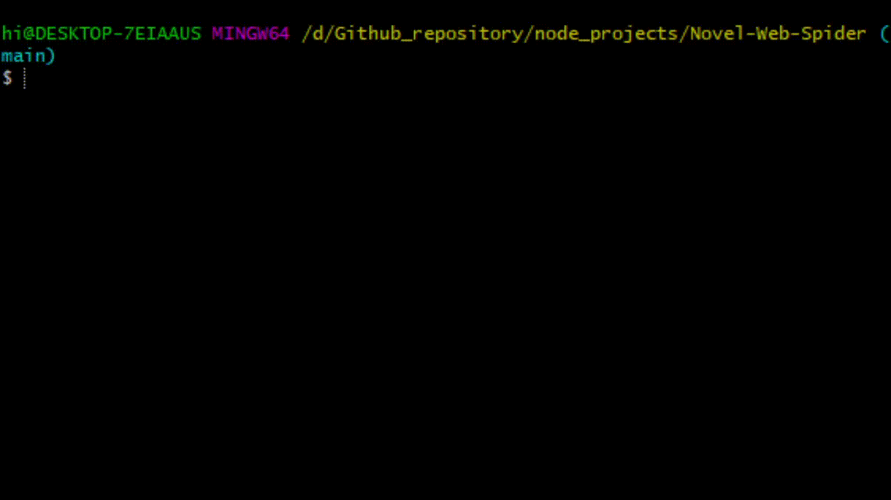

## 📒 使用套件

1. Cheer io → html parser
2. request 或是 axios → http request package
3. fs → file system

## Learned

1. process.argv

> 接收網址用

2. process.stdout.write('\r[... ] 5/10')

> 利用 process stdout 實現漸進式下載條

## 🐱 部屬到 Github

1. repo 設為 public
2. 設定好 .gitignore
    1. node_modules/
    2. 下載到的資料夾
3. 加入 README .md
    1. 用 png 或是 gif 來 Demo
    2. 使用範例
    3. 使用套件
    4. 參考資料
	
	
	
## 使用方式

1. clone repo & install package

```
git clone xxx
npm install
```

2. run script with novel url

```
node index.js http://xxxx.xxx.xxx
```

3. got novel in library folder !

